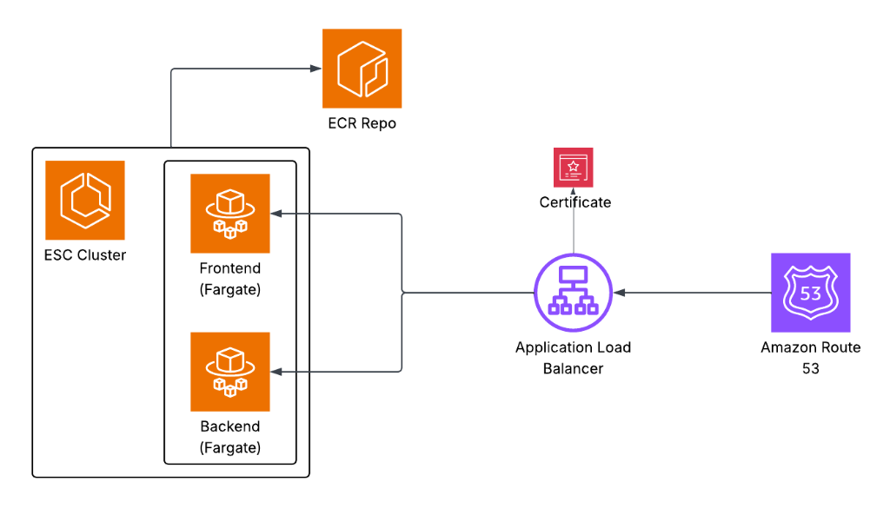
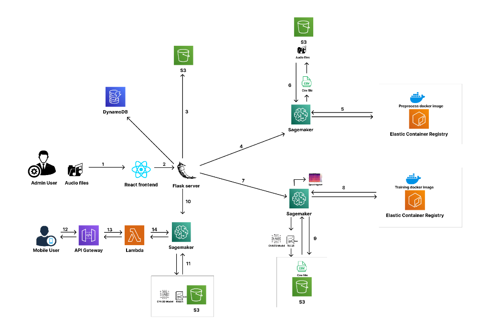

# Audio Admin Panel Frontend

This repository contains the frontend application for the Audio Admin Panel, built with React and Vite. It provides an intuitive interface for managing audio files, visualizations, and interacting with the backend services.

## Architecture

The system architecture works as follows:

### High Level Overview


### Detailed Architecture


## Tech Stack

- **Framework:** React 18
- **Build Tool:** Vite
- **Styling:** Tailwind CSS, Material UI (`@mui/material`)
- **State/Comparison:** standard React hooks
- **HTTP Client:** Axios
- **AWS Integration:** AWS Amplify
- **Audio:** `react-audio-player`, `react-h5-audio-player`

## Project Structure

```
audio-frontend/
├── public/              # Static assets
├── src/                 # Source code
├── .github/workflows/   # CI/CD configurations
├── package.json         # Node.js dependencies/scripts
├── vite.config.js       # Vite configuration
├── tailwind.config.js   # Tailwind CSS configuration
├── Dockerfile           # Container definition
└── nginx.conf           # Nginx configuration for serving
```

## Local Development

### Prerequisites

- Node.js (v18+ recommended)
- npm

### Setup

1.  **Clone the repository:**
    ```bash
    git clone <repository-url>
    cd audio-frontend
    ```

2.  **Install dependencies:**
    ```bash
    npm install
    ```

3.  **Run the development server:**
    ```bash
    npm run dev
    ```
    The application will be available at `http://localhost:5173` (or the port specified in terminal).

4.  **Build for production:**
    ```bash
    npm run build
    ```

## Deployment

The project uses **GitHub Actions** for Continuous Integration and Continuous Deployment (CI/CD) to **AWS ECS (Fargate)**.

### Workflow

1.  **Trigger:** A pull request is merged into the `main` branch.
2.  **Build & Test:**
    - Sets up Node.js environment.
    - Installs dependencies (`npm ci`).
    - Builds the application (`npm run build`).
3.  **Build & Push Image:**
    - Logs into Amazon ECR.
    - Builds the Docker image.
    - Pushes the image to the ECR repository: `audio-frontend`.
4.  **Deploy:**
    - Updates the AWS ECS service `audio-frontend-service` in cluster `audio-cluster`.
    - Forces a new deployment to pick up the latest image.

## Environment Variables

Ensure the following secrets are configured in your GitHub repository for deployment:

- `AWS_ACCESS_KEY_ID`
- `AWS_SECRET_ACCESS_KEY`
- `AWS_REGION`
